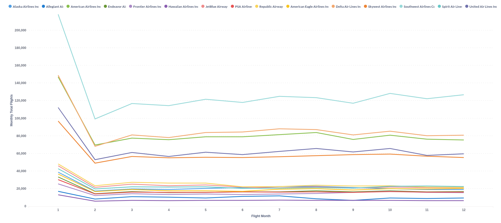
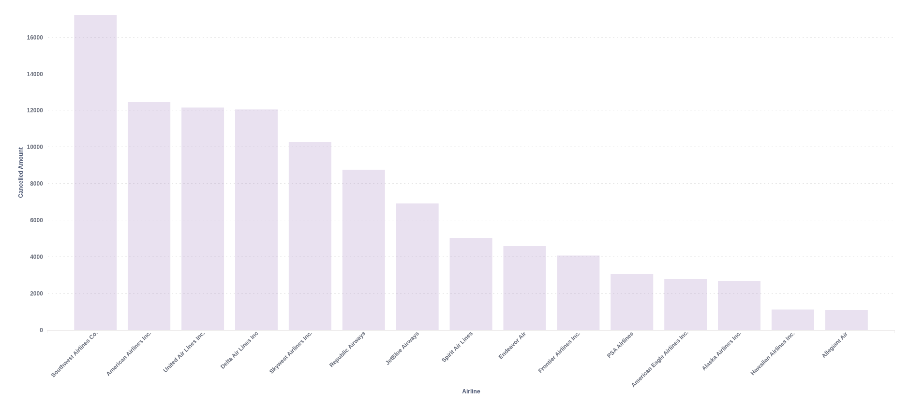
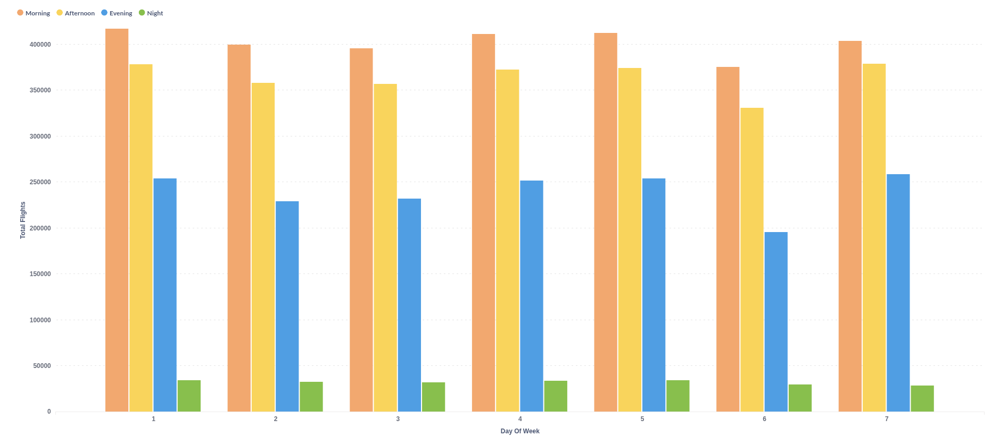
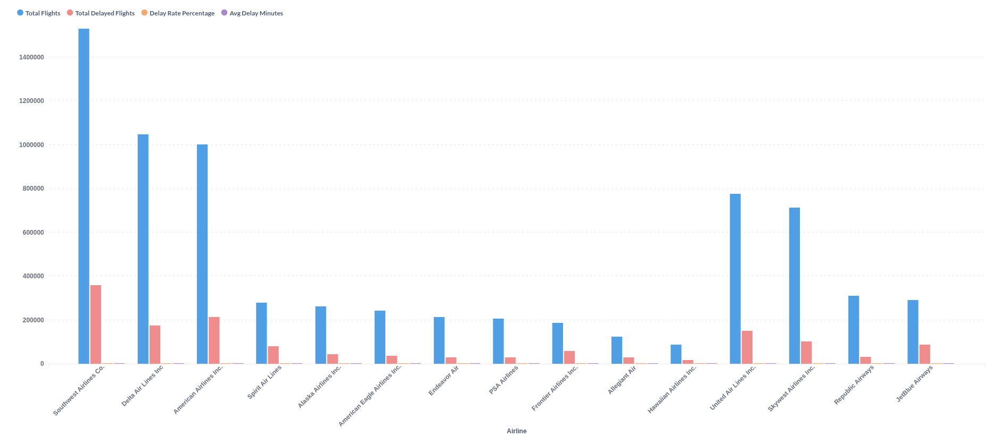

# ✈️ US Flight Delay Analytics (2023) - End-to-End Data Engineering Pipeline

## 📝 Problem Statement

Flight delays and cancellations are persistent issues in the aviation industry, costing billions of dollars annually. This project demonstrates a **production-grade data engineering solution** for processing and analyzing large-scale flight operations data (6 million+ rows from 2023).

**The Challenge:**
Build a scalable, automated batch pipeline that ingests raw data from external sources, processes it reliably at scale, transforms it into analytical-ready format, and makes it accessible through a data warehouse - all while maintaining data quality and reproducibility.

**Key Engineering Objectives:**
- ✅ **Infrastructure as Code**: Provision AWS resources reproducibly (Terraform)
- ✅ **Workflow Orchestration**: Automate multi-step ELT pipelines (Apache Airflow)
- ✅ **Distributed Processing**: Handle 6M+ records efficiently (Apache Spark)
- ✅ **Analytics Engineering**: Build modular, tested transformations (dbt)
- ✅ **Data Quality**: Implement validation and testing throughout
- ✅ **Reproducibility**: Fully containerized, documented, ready for deployment

**Analytics & Business Objectives:**
The pipeline enables answering critical questions about flight operations:
- **Airline Performance**: Which airlines have the highest/lowest on-time performance, cancellation rates, and delay metrics?
- **Temporal Patterns**: How do flight volumes and delays trend across months and seasons? What patterns emerge by time of day?
- **Operational Insights**: How do flight patterns vary by day of week, time period, and airline operations?
- **Cancellation Analysis**: Which airlines and periods experience the highest cancellation rates?
- **Delay Distribution**: What is the distribution of delays across airlines, and how does it correlate with flight volume?

**Deliverables:**
- Interactive Metabase dashboard with 4 key analytics tiles
- **Tile 1**: Monthly flight trends by airline (temporal analysis)
- **Tile 2**: Cancellations by airline (categorical performance)
- **Tile 3**: Flight distribution by time of day and day of week
- **Tile 4**: Airline KPIs - total flights, delays, delay rate, and avg delay minutes

**Architecture:** Medallion Architecture (Raw → Clean → Business)  

---

## 🏗️ Architecture Overview

The project follows the **Medallion Architecture** (Raw → Clean → Business) orchestrated by Apache Airflow on AWS:

Kaggle → S3 (Raw) → Spark → S3 (Clean) → dbt/Athena → Dashboard

```
┌─────────────────────────────────────────────────────────────────────────┐
│                         DATA PIPELINE FLOW                              │
└─────────────────────────────────────────────────────────────────────────┘

 Step 1: INGEST                    Step 2: PROCESS                 Step 3: TRANSFORM
┌──────────────────┐          ┌──────────────────┐           ┌────────────────────┐
│ Kaggle API       │          │ Apache Spark     │           │ dbt + AWS Athena   │
│ (Download Data)  │ ────────>│ (Clean & Filter) │ ────────> │ (Business Logic)   │
└──────────────────┘          └──────────────────┘           └────────────────────┘
        │                             │                               │
        ▼                             ▼                               ▼
    AWS S3                       AWS S3                          AWS S3
    (Raw Bucket)                 (Clean Bucket)                  (Business Bucket)
        │                             │                               │
        └─────────────────────────────┴───────────────────────────────┘
                                      │
                                      ▼
                        ┌─────────────────────────────┐
                        │  Metabase Dashboard         │
                        │  (Visualization & BI)       │
                        └─────────────────────────────┘
                                      │
                                      ▼
                        ┌─────────────────────────────┐
                        │  Business Insights          │
                        │  - Delay trends             │
                        │  - Airline performance      │
                        │  - Route analytics          │
                        └─────────────────────────────┘

                        ┌──────────────────────────────┐
                        │ ORCHESTRATION                │
                        │ Apache Airflow (Docker)      │
                        │ Manages all pipeline steps   │
                        └──────────────────────────────┘
                        
                        ┌──────────────────────────────┐
                        │ INFRASTRUCTURE               │
                        │ Terraform (IaC)              │
                        │ Provisions AWS resources     │
                        └──────────────────────────────┘
```

---


## 🛠️ Tech Stack

| Component | Technology | Purpose |
|-----------|-----------|---------|
| **Cloud Provider** | AWS | Data lake (S3), Data warehouse (Athena), Catalog (Glue) |
| **Infrastructure as Code** | Terraform | Provision and manage AWS resources |
| **Orchestration** | Apache Airflow 2.9.0 | Schedule and manage pipeline DAGs |
| **Batch Processing** | Apache Spark 3.5.0 | Data cleaning and transformation at scale |
| **Data Transformation** | dbt 1.10.0 | SQL-based analytics engineering with testing |
| **Data Lake Format** | Parquet (Snappy compression) | Efficient columnar storage |
| **Data Warehouse** | AWS Athena | SQL queries on S3 data |
| **Visualization** | Metabase | Interactive BI dashboard |
| **Database** | PostgreSQL 13 | Airflow metadata store |
| **Containerization** | Docker + Docker Compose | Reproducible environment |

---

## 📁 Project Structure

```
us_flight_delay_analytics/
├── airflow/                          # Airflow DAGs and jobs
│   ├── dags/
│   │   ├── flight_delay_pipeline.py  # Main orchestration DAG
│   │   ├── spark_jobs/
│   │   │   └── spark_preprocessing.py # Spark data cleaning job
│   │   └── dbt_transform/            # dbt project folder
│   │       └── us_flight_analytics/  # dbt models and configs
│   ├── logs/                         # DAG execution logs (auto-generated)
│   └── plugins/                      # Airflow custom operators
├── spark_jobs/                        # Spark job scripts
│   └── spark_preprocessing.ipynb      # Development/testing notebook
├── infra/                             # Terraform infrastructure code
│   ├── main.tf                       # AWS resources configuration
│   ├── variables.tf                  # Input variables
│   └── terraform.tfstate             # Infrastructure state
├── docs/                              # Documentation and links
│   └── RESOURCES.md                  # Reference materials
├── metabase-data/                     # Metabase database files
├── .env                              # ⚠️ Create this file
├── .gitignore                        # Git ignore configuration
├── Dockerfile                        # Airflow container image
├── docker-compose.yml                # Multi-container orchestration
├── pyproject.toml                    # Python dependencies
└── README.md                         # This file
```

---

## 📊 Pipeline Overview

### Stage 1: Data Ingestion
- **Source**: Kaggle dataset (US Civil Flights 2023)
- **Process**: Download using Kaggle CLI
- **Destination**: AWS S3 Raw Bucket
- **Format**: CSV

### Stage 2: Data Processing
- **Tool**: Apache Spark (PySpark)
- **Operations**:
  - Data cleaning (data type inference)
  - Schema validation
  - Format conversion to Parquet with Snappy compression
- **Destination**: AWS S3 Clean Bucket
- **Output Datasets**:
  - `s3://us-flight-delay-analytics-data-lake/clean/flights/` - Flight operations data
  - `s3://us-flight-delay-analytics-data-lake/clean/geo/` - Geographic/airport data
  - `s3://us-flight-delay-analytics-data-lake/clean/cancelled_diverted/` - Cancellation & diversion data
  - `s3://us-flight-delay-analytics-data-lake/clean/weather/` - Weather metrics

### Stage 3: Data Transformation
- **Tool**: dbt (data build tool)
- **Operations**:
  - Create external tables (crawl data from s3)
  - Create staging models (raw data standardization)
  - Build intermediate models (feature engineering)
  - Build business models (aggregated facts and dimensions)
  - Run automated tests and data quality checks
- **Partition**: Data is segmented by year and month to optimize queries on AWS Athena. This reduces the amount of data scanned (data scraped) when the console filters by time, thereby speeding up queries and saving AWS costs.
- **Destination**: AWS S3 Business Bucket + Athena Tables


### Stage 4: Visualization
- **Tool**: Metabase
- **Dashboards**: 
  - Delay distribution by airline (categorical)
  - Monthly delay trends (temporal)
  - Route performance analysis
  - Weather impact correlation

---

## � Dashboard & Analytics Visualizations

The project includes a comprehensive Metabase dashboard with 4 key analytics tiles that provide actionable insights into flight operations:

### Tile 1: Monthly Flight Trends by Airline
**Temporal Analysis** - Tracks flight volume patterns across all 12 months for each major airline:
- Shows seasonal variations and carrier-specific trends
- Identifies peak travel periods and low-traffic months
- Compares performance across airlines over time



### Tile 2: Cancellation Analysis by Airline
**Categorical Performance** - Displays the distribution of cancelled flights across airlines:
- Identifies airlines with highest cancellation rates
- Highlights operational reliability issues
- Enables service quality comparison between carriers



### Tile 3: Flight Activity by Time Period & Day of Week
**Operational Patterns** - Shows how flight volume varies by time of day and day of week:
- Compares morning, afternoon, evening, and night flights
- Reveals usage patterns across weekdays and weekends
- Helps understand peak operational hours



### Tile 4: Airline Performance Metrics (KPIs)
**Comprehensive Performance Dashboard** - Presents key metrics for each airline:
- **Total Flights**: Overall volume and market share
- **Total Delayed Flights**: Absolute number of delayed operations
- **Delay Rate Percentage**: On-time performance ratio
- **Average Delay Minutes**: Average delay duration per flight



---

## �🚀 Quick Start

### Prerequisites
- Python 3.11+
- **uv** - Fast Python package manager ([install here](https://astral.sh/uv/))
- Docker & Docker Compose
- Terraform
- dbt
- AWS Account with S3, Athena, and Glue access
- Kaggle API credentials
- Git

### Complete Setup Guide

#### Step 1: Clone the Repository
```bash
git clone https://github.com/hdminh279/us_flights_analytics_2023_DE_Capstone.git
cd us_flights_analytics_2023_DE_Capstone
```

#### Step 2: Create Required Directories

Some directories are excluded from Git (ignored in `.gitignore`) because they contain auto-generated files. Create them manually:

```bash
# Create Airflow directories
mkdir -p airflow/logs
mkdir -p airflow/plugins
```

**Why these directories?**
- `airflow/logs/` - Auto-populated with DAG execution logs (changes every run)
- `airflow/plugins/` - For custom Airflow operators and hooks

#### Step 3: Create Environment Configuration

Create a `.env` file in the project root with your credentials:

```bash
# AWS Credentials
AWS_ACCESS_KEY_ID=your_aws_access_key_id
AWS_SECRET_ACCESS_KEY=your_aws_secret_access_key
AWS_DEFAULT_REGION=us-east-1

# Kaggle Credentials
KAGGLE_USERNAME=your_kaggle_username
KAGGLE_KEY=your_kaggle_api_key

# Airflow Configuration
AIRFLOW_UID=50000
```

#### Step 4: Set Up Python Virtual Environment with uv

This project uses **uv** for fast, reliable dependency management. If you don't have `uv` installed, get it from [astral.sh/uv](https://astral.sh/uv/).

```bash
# Initialize Python 3.11 environment and install dependencies
uv sync

# Activate virtual environment
# Ubuntu
source .venv/bin/activate
# Windows
.\.venv\Scripts\activate

# Verify Python version
python --version  # Should show 3.11.x
```

**Why uv?**
- ⚡ 10-100x faster than pip
- 🔒 Reproducible builds with uv.lock
- 📦 Better dependency resolution
- 🎯 Lock file for team consistency

**Alternative (without uv):**
```bash
# If you prefer traditional venv + pip:
python3.11 -m venv .venv
# Ubuntu
source .venv/bin/activate
# Windows
.\.venv\Scripts\activate
pip install -e .  # Installs from pyproject.toml
```

#### Step 5: Initialize Terraform Infrastructure

- Set up your project name, glue name,... in variables.tf and main.tf
- Go to aws web -> AWS Lake Formation -> Administrative roles and tasks -> Data lake administrators: Add your IAM Users.

- Add to .env
```
TARGET_S3_BUCKET=your_bucket_S3 (...-data-lake) (no s3://)
S3_ATHENA_RESULT=your_dir (suggest: s3://...-athena-result/prefix)
S3_BUCKET_FINAL_RESULT=your_dir (suggest: s3://...-data-lake/business)
DATABASE_NAME=(your glue name in main.tf)

Example:
TARGET_S3_BUCKET=us-flight-delay-analytics-data-lake
S3_ATHENA_RESULT=s3://us-flight-delay-analytics-athena-result/prefix/
S3_BUCKET_FINAL_RESULT=s3://us-flight-delay-analytics-data-lake/business/

```

```bash
cd infra

# Note: Save `.env` with AWS credentials before running terraform apply

# Initialize Terraform
terraform init

# Plan infrastructure changes
terraform plan

# Apply infrastructure (creates AWS resources)
terraform apply

cd ..
```


#### Step 6: Build and Start Docker Containers

```bash
# Start all services (Airflow, PostgreSQL, Metabase)
docker compose up -d --build

# Check service status
docker compose ps
```

**Expected output:**
```
NAME                    COMMAND                  SERVICE             STATUS
postgres                postgres                 postgres            Up 2 seconds
metabase                /app/run_metabase.sh    metabase            Up 2 seconds
airflow-webserver       airflow webserver        airflow-webserver   Up 5 seconds
airflow-scheduler       airflow scheduler        airflow-scheduler   Up 5 seconds
```

---

## 🌐 Access Applications

| Service | URL | Username | Password |
|---------|-----|----------|----------|
| **Airflow UI** | `http://localhost:8080` | `airflow` | `airflow` |
| **Metabase** | `http://localhost:3000` | - | (Setup on first access) |
| **PostgreSQL** | `localhost:5432` | `airflow` | `airflow` |

---

## 🔄 Pipeline Execution

### Triggering the Pipeline

1. **Via Airflow UI**:
   - Navigate to DAGs tab
   - Select `flight_delay_pipeline`
   - Click "Trigger DAG"

2. **Via CLI**:
```bash
docker-compose exec airflow-webserver airflow dags trigger flight_delay_pipeline
```

### Monitoring Pipeline Execution

- **Airflow Logs**: `http://localhost:8080/home`
- **Task Details**: Click on task nodes in the DAG graph
- **S3 Data**: Check AWS S3 console for output files

---

### Pipeline Tasks (in order)

1. `create_tmp_folder` - Create temporary directory
2. `download_kaggle_data` - Download dataset from Kaggle
3. `upload_to_s3` - Upload raw data to S3
4. `cleanup_tmp` - Clean up temporary files
5. `spark_preprocessing_job` - Process data with Spark
6. `dbt_install_packages` - Install dbt dependencies
7. `dbt_create_tables` - Create tables in Athena
8. `dbt_run_models` - Build dbt models
9. `dbt_test_models` - Run dbt tests

---

## 📊 Dashboard Specifications

### Dashboard 1: Airline Performance Analysis
- **Tile 1** (Categorical): Distribution of delays by airline
- **Tile 2** (Temporal): Monthly average delays trend

### Dashboard 2: Route Analytics
- Coverage of all major US routes
- Geographic visualization of delay hotspots
- Seasonal patterns analysis

---

## 🔧 Configuration

### Airflow Configuration
- **Executor**: LocalExecutor (development) → can upgrade to CeleryExecutor
- **Database**: PostgreSQL
- **Retry Policy**: Max 1 retry, 5-minute delay
- **Schedule**: `@once` (can be changed to `0 0 * * *` for daily runs)

### dbt Configuration
See [airflow/dags/dbt_transform/us_flight_analytics/README.md](airflow/dags/dbt_transform/us_flight_analytics/README.md)

### Spark Configuration
- Version: 3.5.0
- Master: Local
- Packages: Hadoop AWS, AWS SDK (for S3 access)

### AWS Terraform
See [infra/README.md](infra/README.md) for infrastructure details

---

## 🧪 Data Quality & Testing

### Implemented Tests
- Schema validation in Spark
- dbt tests on model outputs (uniqueness, not-null constraints)
- Data completeness checks
- Referential integrity tests

### Running Tests Manually
```bash
# dbt tests
cd airflow/dags/dbt_transform/us_flight_analytics
dbt test

```

### Implemented Tests
- **PySpark Unit Testing (pytest)**: Modularized testing for Spark transformations before writing to the Clean bucket.
  - *Geo Validation*: Enforces physical boundaries (Lat -90/90, Lon -180/180), 3-letter IATA code constraints via Regex, and duplicate removal.
  - *Flight & Weather Validation*: Trims string artifacts, enforces positive flight durations, and strictly drops records missing essential dimension keys.
- **dbt Testing**: Validates model outputs (uniqueness, not-null constraints, referential integrity).

### Running Tests Manually

**1. Spark Unit Tests (via pytest)**
Run the automated test suite locally to validate data transformations:
```bash
# Ensure you are in the project root
uv run python -m pytest test/test_spark.py -v
```

**2. dbt Tests**
Validate the analytical models and business logic in the data warehouse:
```bash
cd airflow/dags/dbt_transform/us_flight_analytics
uv run dbt test
```
---

## 🐛 Troubleshooting

### Airflow Connection Issues
```bash
docker-compose logs airflow-webserver
docker-compose logs airflow-scheduler
```

### Spark Job Failures
- Check logs: `airflow/logs/dag_id=flight_delay_pipeline/`
- Verify AWS credentials in `.env`
- Confirm S3 bucket exists and is accessible

### dbt Errors
```bash
cd airflow/dags/dbt_transform/us_flight_analytics
dbt debug
dbt run --debug
```

### PostgreSQL Issues
```bash
docker-compose down -v  # Remove volumes
docker-compose up -d    # Restart fresh
```

### Setup Issues

#### "airflow/logs directory not found"
After cloning the repository, ensure all required directories exist:
```bash
mkdir -p airflow/logs
mkdir -p airflow/plugins
mkdir -p docs
mkdir -p metabase-data
mkdir -p spark_jobs
```

Or run the complete setup:
```bash
# From project root
bash scripts/setup.sh  # If available
# Or manually:
for dir in airflow/logs airflow/plugins docs metabase-data spark_jobs; do
  mkdir -p "$dir"
done
```

#### "Permission denied" on airflow/logs
```bash
# Fix permissions
chmod -R 755 airflow/logs airflow/plugins

# Or use Docker to handle it:
docker-compose exec airflow-webserver chmod -R 755 /opt/airflow/logs
```

#### ".env file not found"
The `.env` file is ignored by Git (not tracked). Create it in the project root:
```bash
# Create from template
cat > .env << EOF
AWS_ACCESS_KEY_ID=your_key
AWS_SECRET_ACCESS_KEY=your_secret
AWS_DEFAULT_REGION=us-east-1
KAGGLE_USERNAME=your_username
KAGGLE_KEY=your_key
TARGET_S3_BUCKET=your_bucket
AIRFLOW_UID=50000
EOF
```

---

## 🚀 DevOps & CI/CD Pipeline

To ensure reliability and maintainability, this project implements an automated CI/CD pipeline using GitHub Actions, transitioning from a basic script to a production-grade workflow.

### Continuous Integration (CI)
On every Pull Request or Push to the `main` branch, the CI pipeline automatically executes:
- **Linting & Formatting:** Enforces clean, standardized code using `Ruff` for Python (Spark/Airflow DAGs) and `SQLFluff` for SQL/dbt models.
- **Infrastructure Validation:** Validates Terraform syntax and logic (`terraform validate`).
- **Data Model Verification:** Runs `dbt compile` to convert Jinja templated models into raw SQL, catching syntax and macro errors before deployment.
- **Environment Checks:** Tests the Docker Compose build to prevent dependency conflicts.

### Continuous Deployment (CD)
*(In implementation phase)*
- **Infrastructure as Code (IaC):** Automated `terraform apply` to provision AWS resources (S3, Glue, Athena).
- **Artifact Syncing:** Seamless deployment of Airflow DAGs and PySpark scripts to AWS S3.

---

## 📦 Dependencies

See [pyproject.toml](pyproject.toml) for complete list:
- apache-airflow==2.9.0
- pyspark==3.5.0
- dbt-athena-community==1.10.0
- pandas>=3.0.1
- awscli
