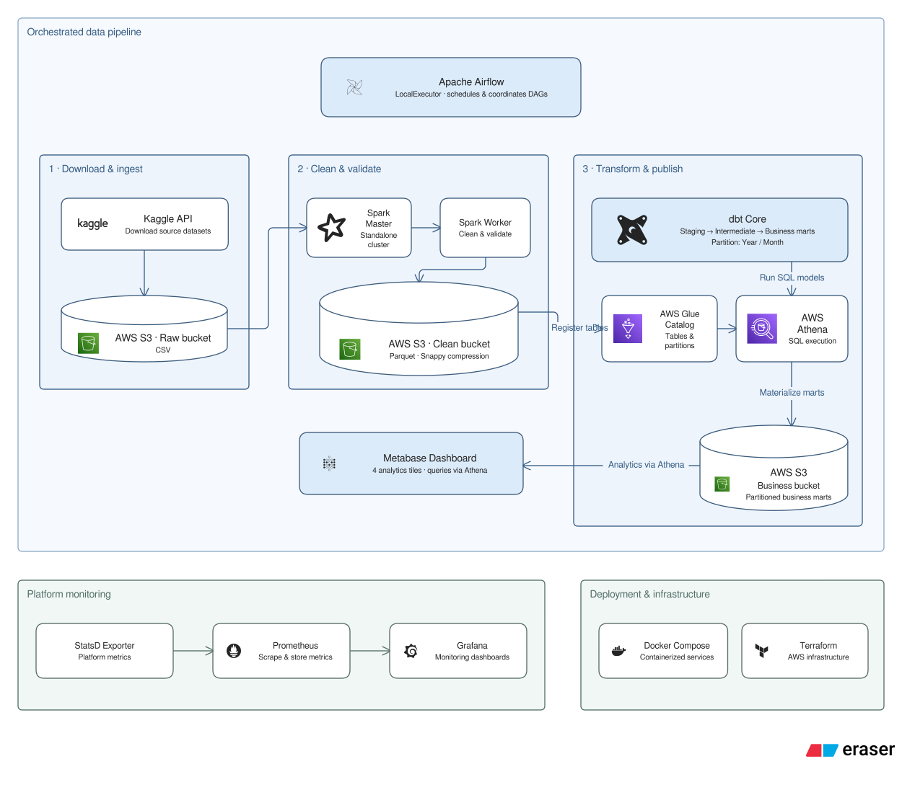
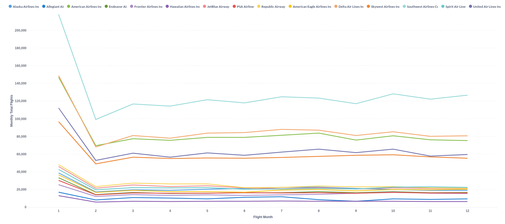
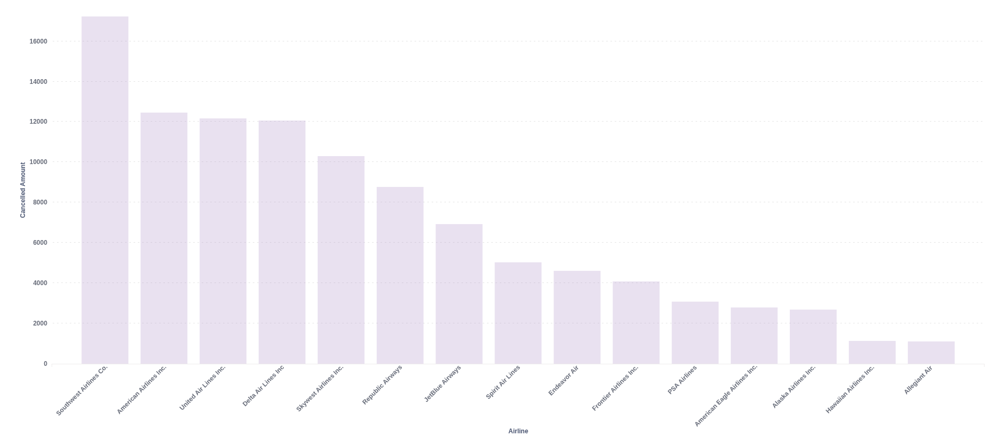
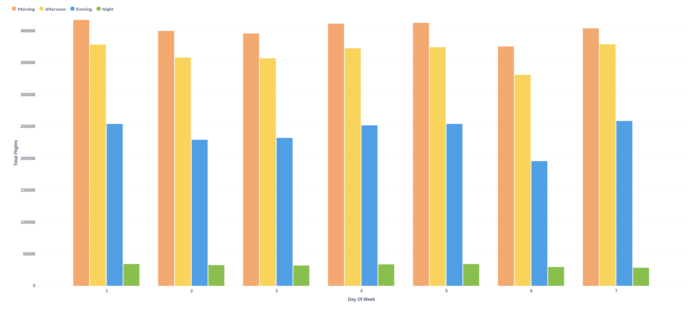
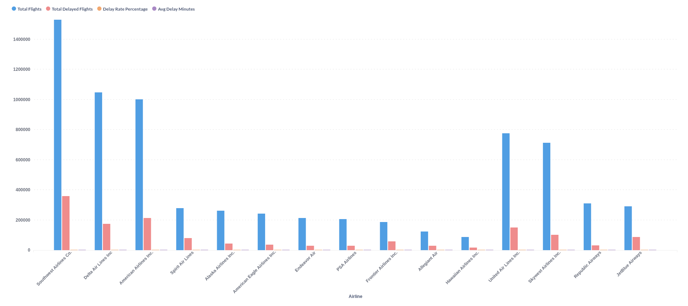

# US Flight Delay Analytics (2023) - Data Pipeline

Scalable batch data pipeline processing 6M+ flight records to uncover operational bottlenecks, weather impacts, and airline reliability metrics.

## Architecture

[](docs/architecture.svg)


## Performance Benchmarks & Results

- End-to-End Runtime: ~7 minutes for the complete Airflow DAG.
- Spark Distributed Processing: Cleans and validates 6M+ rows in ~3.5 minutes using a dedicated worker.
- Storage Optimization: Snappy-compressed Parquet reduced raw data footprint on S3 by 75%.
- Query Cost & Speed: Partitioning the business layer by `flight_year` and `flight_month` reduced scanned data in Athena by over 90% per dashboard query.

## Visualizations & Insights

### 1. Monthly Flight Trends by Airline
Tracks monthly volume changes, highlighting peak operational periods and seasonal drops.



### 2. Cancellation Analysis by Airline
Ranks airlines by total cancellations to pinpoint carriers with structural reliability issues.



### 3. Flight Activity by Day of Week & Time Period
Maps flight frequency and delay likelihood across morning, afternoon, evening, and night time blocks.



### 4. Airline Performance KPIs
Core scorecard summarizing total flights, delayed volume, delay rate percentage, and average delay duration.



## Quick Start Guide

### Prerequisites
- Docker & Docker Compose
- Terraform
- uv (Python 3.11 package manager)
- AWS Account (S3, Glue, Athena)
- Kaggle API key

### 1. Clone & Configure Environment

```bash
git clone https://github.com/hdminh279/us_flights_analytics_2023_DE_Capstone.git
cd us_flights_analytics_2023_DE_Capstone
cp .env.example .env
```

Fill in required variables in `.env`:
```ini
AWS_ACCESS_KEY_ID=your_access_key
AWS_SECRET_ACCESS_KEY=your_secret_key
AWS_DEFAULT_REGION=us-east-1

KAGGLE_USERNAME=your_kaggle_username
KAGGLE_KEY=your_kaggle_key

TARGET_S3_BUCKET=your_s3_bucket_name
S3_ATHENA_RESULT=s3://your_s3_bucket_name/athena_results/
S3_BUCKET_FINAL_RESULT=s3://your_s3_bucket_name/business/
DATABASE_NAME=your_glue_database_name
ALERT_EMAIL=your_email@example.com
```

### 2. Deploy AWS Infrastructure

```bash
cd infra
terraform init
terraform apply -auto-approve
cd ..
```

### 3. Launch Docker Services

```bash
# Create required mount directories if not present
mkdir -p airflow/logs airflow/plugins

# Build and start services
docker compose up -d --build
```

### 4. Run the Pipeline

Trigger the pipeline via Airflow Web UI at `http://localhost:8080` (credentials: `airflow` / `airflow`) or via terminal:

```bash
docker compose exec airflow-webserver airflow dags trigger flight_delay_pipeline
```

## Service Access

| Service | Address | Default Credentials |
| --- | --- | --- |
| Airflow UI | http://localhost:8080 | airflow / airflow |
| Spark Master UI | http://localhost:8081 | - |
| Metabase | http://localhost:3000 | Set up on first visit |
| Grafana | http://localhost:3031 | admin / admin |
| Prometheus | http://localhost:9090 | - |
| PostgreSQL | localhost:5432 | airflow / airflow |

## Testing

Run Spark transformation unit tests:
```bash
uv run python -m pytest test/test_spark.py -v
```

Run dbt data quality models test:
```bash
cd airflow/dags/dbt_transform/us_flight_analytics
uv run dbt test
```
